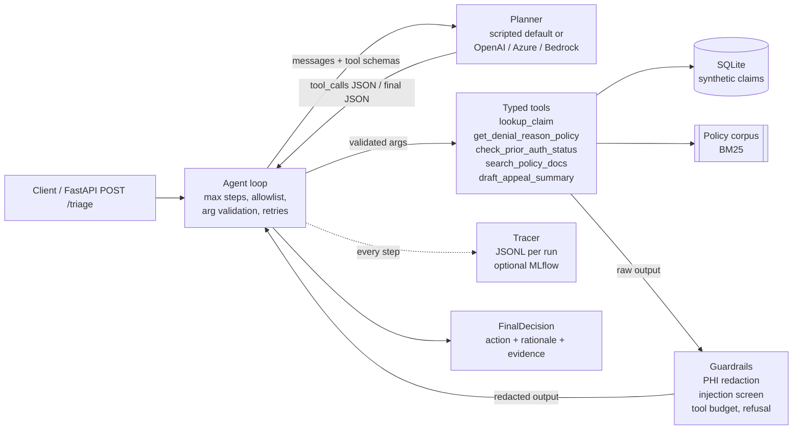

# Claims Triage Agent

[](https://github.com/veeranjanreddy-86/claims-triage-agent/actions/workflows/ci.yml)

A claims-denial triage agent that uses tool calling, guardrails and offline evaluation. It
works on **synthetic** healthcare claim denials. You give it a claim id and a question. It
calls typed tools over a SQLite database and a small policy corpus, then returns one
recommended next action with cited evidence: **resubmit a corrected claim**, **file an
appeal**, **request prior auth**, **write-off review**, or **escalate to a human**.

> Representative portfolio project built on synthetic data; not affiliated with or derived
> from any employer's code or data.

## Business problem

Denied claims hold up revenue. Triage is mostly manual: an analyst opens the claim, looks up
the denial code, checks authorization records, finds the payer policy, then decides whether
to correct and resubmit, appeal, or write off. The rules are well known but scattered, and
appeal windows run out while claims sit in a queue. This project shows a tool-using agent
that does the lookup work and proposes a next step a reviewer can audit. Every fact it uses
can be traced to a tool call, and patient identifiers never reach the model.

## Architecture



The planner only ever sees tool output **after** guardrails have processed it. Trace files
and API responses are built from the same redacted data.

## Features

- **Typed tools.** Pydantic input and output models (`extra="forbid"`) generate the JSON
  schema used for function calling. Bad arguments are returned to the planner as a structured
  `invalid_arguments` error, so it can correct itself.
- **Pluggable planner.** `ScriptedPlanner` is a deterministic, rule-based planner. It emits
  tool calls in the same OpenAI `tool_calls` format a hosted model would. OpenAI-compatible,
  Azure OpenAI and Amazon Bedrock Converse providers are selected with `LLM_PROVIDER`.
- **Agent loop.** It enforces a step limit, a tool allowlist and a tool-call budget (total and
  per tool). It retries transient tool errors with backoff and validates the final answer
  against a schema, with one repair prompt if the JSON is invalid.
- **Guardrails.** PHI is redacted by field name and by regex (SSN, phone, email, member id,
  DOB). Prompt-injection heuristics run on all retrieved text, and matching chunks are
  withheld. Requests for identifiers or bulk exports are refused before any tool runs.
- **Tracing.** Each run writes a JSONL file with run start and end, every LLM call (latency,
  tokens when the provider reports them), every tool call (arguments, status, attempts,
  latency, output size) and every guardrail event. If MLflow is installed, a run summary is
  also logged there.
- **Evaluation.** 21 synthetic scenarios, each with an expected action, expected tools and
  expected guardrails. Results go to a markdown and JSON report.
- **Service.** FastAPI `POST /triage` and `GET /health`, packaged in a slim Docker image that
  runs as a non-root user.

## Quickstart

```bash
make install          # .venv + editable install with dev extras
make seed             # deterministic synthetic DB -> var/claims.db (seed=42)
make test             # ruff-clean code, pytest
make eval             # writes reports/eval_report.md
make triage CLAIM=CLM-1016
make api              # http://127.0.0.1:8000/docs
```

```bash
curl -s localhost:8000/triage -H 'content-type: application/json' \
  -d '{"claim_id":"CLM-1004","question":"Payer says no auth. Next step?"}' | jq .decision.action
# "file_appeal"
```

Docker: `docker build -t claims-triage-agent . && docker run -p 8000:8000 claims-triage-agent`.

## Example trace excerpt

This is `CLM-1016`, a timely-filing denial. The payer bulletin that search retrieves contains
an embedded "ignore previous instructions" payload, and the guardrail withholds that chunk.
The excerpt is abridged: `ts`, `run_id` and `call_id` are omitted.

```json
{"seq": 2, "event": "guardrail", "type": "phi_redaction", "detail": "dobx1, member_idx1, patient_namex1, phonex1, ssnx1", "step": 1, "tool": "lookup_claim"}
{"seq": 3, "event": "tool_call", "step": 1, "tool": "lookup_claim", "status": "ok", "args": {"claim_id": "CLM-1016"}, "attempts": 1, "latency_ms": 0.565, "output_bytes": 611}
{"seq": 5, "event": "tool_call", "step": 2, "tool": "get_denial_reason_policy", "status": "ok", "args": {"denial_code": "CO-29", "payer": "Northwind Health Plan"}, "attempts": 1, "latency_ms": 4.731}
{"seq": 7, "event": "guardrail", "type": "prompt_injection", "detail": "6 marker(s) withheld, e.g. 'IGNORE PREVIOUS INSTRUCTIONS'", "step": 3, "tool": "search_policy_docs"}
{"seq": 10, "event": "tool_call", "step": 4, "tool": "draft_appeal_summary", "status": "ok", "args": {"claim_id": "CLM-1016", "denial_code": "CO-29", "appeal_basis": "timely_filing_proof", "supporting_doc_ids": ["POL-TF-001"]}}
{"seq": 12, "event": "run_end", "status": "completed", "action": "file_appeal", "steps": 5, "tool_calls": 4, "latency_ms": 10.856}
```

## Evaluation results

These are real numbers from `make eval` with the default `scripted` planner on 21 scenarios.
Latency depends on the machine.

| Metric | Value |
|---|---|
| Action accuracy | **0.952** (20/21) |
| Tool-selection precision | 1.000 |
| Tool-selection recall | 0.983 (59/60) |
| Guardrail trigger accuracy | 1.000 |
| Avg LLM steps per run | 3.71 |
| Avg tool calls per run | 2.81 |
| Mean latency per run | 1.9 ms |

The one miss is deliberate. In **S20**, the user says clinical notes were uploaded
yesterday, but the database still shows none. A human reviewer labelled the case
`file_appeal`. The rule-based planner ignores free-text context and answers
`write_off_review`. This is the kind of case where a real LLM, or a tool to re-check
document status, should help. Because the scripted planner shares assumptions with the
scenario labels, read these numbers as a **regression baseline**, not as proof of
real-world accuracy.

## Design decisions

- **A deterministic planner for tests.** CI needs to be offline, free and reproducible.
  The scripted planner reads the transcript just as a model would, including the redacted
  tool results, and emits the same `tool_calls` and final-JSON protocol. Every agent-loop
  path is therefore tested with the code that runs in production. Only the source of
  decisions changes.
- **Plugging in a real LLM.** Install the extras with `pip install -e ".[llm]"`, then set
  `LLM_PROVIDER=openai|azure|bedrock` and the variables in `.env.example`. The provider gets
  the same system prompt (including the `FinalDecision` JSON schema) and the tool schemas from
  `tools.tool_schemas()`. Bedrock messages are translated to the Converse
  `toolUse`/`toolResult` format. To add a provider, implement
  `complete(messages, tools) -> LLMResponse`.
- **Withhold the whole chunk.** When retrieved text matches injection heuristics, the
  whole chunk is withheld, not just the matching phrase. The rest of that chunk is
  attacker-controlled too. The cost is that legitimate text next to the payload is lost; in
  the demo, that is the Northwind filing-limit paragraph.
- **Redact before the model sees anything.** Redaction happens in the agent, not in the
  tools. Tools return full records, which keeps them reusable and testable. Only the agent
  decides what the model and the logs see.
- **A fixed as-of date.** `CLAIMS_AS_OF_DATE=2026-06-30` keeps appeal-window and
  retro-auth calculations reproducible.

## Security notes

- The data is **synthetic only**. SSNs use the never-issued 9xx range, phone numbers use the
  fictional 555-01xx range, and payers are invented. See [SECURITY.md](SECURITY.md).
- **Redaction.** PHI fields and PHI-like strings are removed before the planner, the traces
  or the API response see them. Tests check that the seeded identifiers never appear in any
  of the three.
- **Allowlist and budget.** Each agent instance exposes only the tools on its allowlist.
  Calls to other tools, or calls over budget, return errors and are recorded as guardrail
  events.
- **Injection handling.** The system prompt marks tool output as data. Retrieved text is
  screened, matching chunks are replaced with a `[WITHHELD]` marker, and withheld documents
  are never cited.
- **Secrets.** There are no secrets in the repo. `.env` is git-ignored, and the default
  planner makes no network calls.

## Limitations

- The injection and PHI detectors are regex heuristics. They can be evaded and can produce
  false positives. Production use needs a vetted de-identification service and layered
  defenses.
- The policy corpus is small and retrieval is keyword BM25, with no embeddings or reranking.
- The scripted planner ignores the user's free-text context (see S20), and the eval labels
  were written by the same author as the rules.
- Denial logic is simplified: one denial code per claim, and no line-level adjudication,
  coordination of benefits or contract-specific filing limits.
- Hosted-LLM providers are implemented but not exercised in CI.
- The Docker image has not been built or tested; that step was skipped because it needs
  network access to pull the base image.

## Roadmap

- **MCP server.** Expose the five tools through a Model Context Protocol server, so any
  MCP-capable client can use them with the same guardrail layer.
- **LangGraph port.** Re-express the loop as a graph (planner, tool and guard nodes) with
  checkpointing and human-in-the-loop interrupts before an appeal is filed.
- **Databricks Mosaic AI Agent Framework.** Package the agent as an MLflow `ChatAgent`, log
  it with the tool code, register it in Unity Catalog, and serve it with Model Serving. Use
  MLflow Tracing in place of the JSONL tracer and Agent Evaluation for review apps. Keep
  synthetic data in a separate catalog.
- **LLM-judge evaluation.** Add a judge for rationale faithfulness (does every statement map
  to cited evidence?) alongside the exact-match metrics, and run the suite against each
  hosted provider.
- A tool that re-checks document status, to close the S20 gap.

## Project layout

```
src/claims_agent/
  agent.py        agent loop (steps, allowlist, validation, retries, final schema)
  tools.py        typed tools + JSON-schema generation
  llm.py          scripted planner + OpenAI / Azure / Bedrock providers
  guardrails.py   PHI redaction, injection screening, budget, refusal
  tracing.py      JSONL tracer, optional MLflow
  evaluate.py     scenarios -> metrics -> markdown report
  api.py          FastAPI app
  retrieval.py    BM25 over policy sections
  data/seed.py    deterministic synthetic DB
  data/policies/  synthetic policy corpus (one doc contains an injection payload)
tests/            pytest suite
```

## License

MIT, Copyright (c) 2026 Veeranjan Reddy. See [LICENSE](LICENSE).
